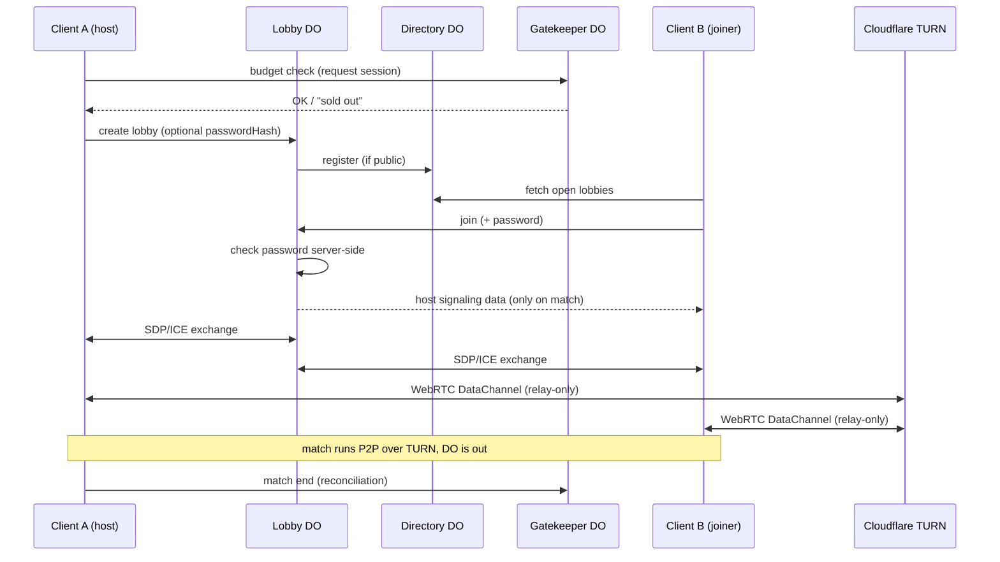

# SPEC — Netcode Transport & Hosting (amigo-metropolis)

> Target repo: `amigo-metropolis` · Location: `docs/specs/hosting.spec.md`
> Status: v1 — adopted from the "Netcode & Hosting Handoff" (2026-07)
> Related: `netcode.spec` (lockstep + determinism), `input.spec`, `architecture.md` §5

**Scope:** the multiplayer transport, lobby, and hosting subsystem around the
1v1 mode. The deterministic simulation (30 Hz lockstep, restricted-float pure-TS
core with LUT sin/cos, mulberry32, FNV-1a tick hashing — see `netcode.spec` §2;
the handoff's "Q16.16/WASM" wording was stale and is corrected here) is already
specified in `netcode.spec` / `input.spec` / `camera.spec` and is **not**
re-specified. This document covers only the transport / connection / cost layer
**around** the sim.

**Relationship to the shipped Phase-6 relay:** the Durable-Object WebSocket
relay (`/room/<CODE>`, `RoomLogic`) stays in the tree as the code-based fallback
path. This spec adds the **primary** online path: peer-to-peer WebRTC through
Cloudflare TURN, with the DOs reduced to handshake traffic — a handful of
requests per match instead of a 30 Hz stream.

---

## 1. Goal & constraints

- **Browser-only.** The only target. No native client, no dedicated game server.
- **Strictly 1v1.** Exactly two peers per match. No mesh / host-star topology needed.
- **Zero-cost goal.** Must run permanently within the Cloudflare free tier.
  Exceeding the budget must degrade *gracefully* ("sold out for today"), never
  produce a bill.
- **Privacy.** No player may be forced to leak their real IP to the opponent.
- **Determinism untouched.** This layer is pure transport. The sim stays
  bit-identical whether the match runs P2P-direct or through a relay.

## 2. Architecture overview

Three logical roles, all on Cloudflare:

| Role | Cloudflare product | Job |
|------|--------------------|-----|
| **Lobby/Signaling** | Durable Object (1 DO per lobby) | lobby state, password check, SDP/ICE brokering |
| **Directory** | Durable Object (singleton) | list of open public lobbies |
| **Budget gatekeeper** | Durable Object (singleton) | session rationing, token bucket, per-day hard counter |
| **TURN relay** | Cloudflare Realtime TURN | relays the WebRTC match traffic (relay-only) |

The actual match traffic does **not** flow through the DOs; it is peer-to-peer
over a WebRTC DataChannel, relayed through TURN. The DOs see only the handshake.

```
  Client A ──┐                          ┌── Client B
             │   1. HTTP/WS signaling   │
             ├──────────────►  Lobby DO ◄──────────┤
             │   (SDP/ICE, password)    │
             │                          │
             │   2. WebRTC DataChannel (relay-only)
             └────────►  Cloudflare TURN  ◄─────────┘
                        (match traffic, 30 Hz inputs)
```

## 3. Components

### 3.1 Client (browser, TypeScript + Three.js)

- Keeps the existing deterministic sim core (unchanged).
- **WebRTC peer** with `RTCPeerConnection`, configured **relay-only**:
  ```ts
  new RTCPeerConnection({
    iceTransportPolicy: "relay", // forces relay, gathers NO host/srflx candidates
    iceServers: [{
      urls: "turn:<cf-turn-endpoint>?transport=udp",
      username: "<short-lived-credential>",
      credential: "<short-lived-credential>",
    }],
  });
  ```
  → The real IP appears neither in the SDP nor on the data path; the opponent
  only ever sees the TURN IP.
- **DataChannel** for inputs:
  ```ts
  pc.createDataChannel("inputs", { ordered: false, maxRetransmits: 0 });
  ```
  Unreliable/unordered (UDP-like, no head-of-line blocking). A second,
  reliable/ordered `"control"` channel carries the low-rate control plane
  (hello/start, periodic state hashes, desync notice).
- **Input redundancy:** every packet carries the last `k` ticks of input
  (small, ~60 B). A lost packet is covered by the next one → effectively
  guaranteed delivery without reliable-mode latency. Fits lockstep (every tick
  needs both inputs guaranteed).
- Lobby UI (list, create, join with optional password).

### 3.2 Lobby/Signaling Durable Object

- **One DO per lobby.** The DO name *is* the lobby ID. In-memory state only
  (→ **no SQLite state**, no storage billing; the class is still SQLite-backed
  because the free tier requires it — it just never persists lobby state).
- Holds: lobby ID, optional `passwordHash`, host signaling data, status
  (`open` / `signaling` / `matched` / `closed`), `createdAt`.
- **Password check is server-side.** The DO releases the host's signaling data
  only once the joiner supplies the correct password hash. Never check
  client-side.
- Brokers SDP offer/answer + ICE candidates between the two peers.
- **TTL/cleanup via alarm:** ghost lobbies (creator leaves before a match,
  signaling aborts) are closed by a DO alarm after a timeout.

### 3.3 Directory Durable Object (singleton)

- Holds the list of open **public** lobbies (ID, name, "password-protected:
  yes/no").
- Private lobbies are shared by code/link and do **not** appear here.
- A lobby DO registers/unregisters itself once on create/close
  (2 requests per lobby).

### 3.4 Budget gatekeeper Durable Object (singleton)

Enforces the "sold out for today" behaviour. **Source of truth is this DO, not
the Cloudflare API.**

- **Token bucket** (intra-day rationing): refills continuously at rate
  `B/day`, cap = daily budget. Unused morning capacity is available in the
  evening — but **never above the daily cap** (no cross-day banking; the free
  tier hard-resets at 00:00 UTC).
- **Per-UTC-day hard counter** underneath as the absolute ceiling (a full
  bucket must not let more than 100K through across a day boundary).
- **Reservation:** at match start the gatekeeper reserves estimated costs
  (requests for signaling + estimated TURN GB); reconciliation at match end.
- Counter reset at **00:00 UTC** (aligned with Cloudflare's reset).
- Optional: hourly out-of-band reconciliation against the GraphQL Analytics API
  for drift correction (`durableObjectsInvocationsAdaptiveGroups` /
  `durableObjectsPeriodicGroups`; **raw values** — divide the 20:1 billing
  ratio by 20 yourself). Safety net only, never in the hot path.

## 4. Cost & quota model

**Two separate quotas, different units:**

| Resource | Unit | Free tier | Role in the gate |
|----------|------|-----------|------------------|
| Durable Objects | requests/**day** | 100,000/day, reset 00:00 UTC | **binding** — drives "sold out" |
| Cloudflare TURN | GB egress/**month** | 1,000 GB/month (shared SFU+TURN), egress only | uncritical |

- **DO** is now handshake traffic only — a handful of requests per match
  instead of a 30 Hz stream.
- **TURN:** 1v1 relay-only ≈ **~13 MB/match-hour** (60 B/packet × 30 Hz ×
  2 peers). 1,000 GB ÷ 13 MB ≈ **~75,000 match-hours/month** free — even at
  100% relay.
- **Binding bottleneck = the DO daily budget.** The gatekeeper rations by it;
  TURN is only coarsely tracked (match duration × ~13 MB/h against e.g.
  900 GB/month with headroom).
- **Note:** the 1,000 GB TURN tier is shared with SFU. This project uses only
  TURN → the full 1,000 GB.

## 5. Lobby flow



Implementation note: the budget check is enforced **server-side inside lobby
creation** (the lobby DO reserves against the gatekeeper before opening), so it
cannot be bypassed by a client skipping the pre-check; the client-visible
`GET /api/budget` exists so the UI can grey out "create" early.

## 6. Edge cases & lifecycle

- **Creator leaves before a join:** alarm-based TTL closes the lobby,
  directory unregister.
- **Abort during signaling:** timeout in the DO, status `closed`, cleanup.
- **Connection loss after match start:** reconnect/abort logic in the client
  (covers the lobby case too). On a definitive abort: score the match as
  ended, gatekeeper reconciliation.
- **Daily budget exhausted:** gatekeeper rejects new sessions → UI shows
  "sold out for today, resets at midnight UTC".
- **TURN credentials:** issue short-lived TURN credentials server-side (in the
  lobby DO), never embed static credentials in the client.

## 7. Tech stack

- **Client:** TypeScript (strict), Three.js, existing sim core.
- **Server:** Cloudflare Workers + Durable Objects, TypeScript, Wrangler.
- **TURN:** Cloudflare Realtime TURN.
- **Tooling:** Bun, Biome, `bun:test`. Atomic imperative-mood commits
  (repo convention). Quality gates per phase: `biome check` + `tsc --noEmit` +
  `bun test` must be green.

## 8. Phase plan

Tracked as **Phase 8 (H0–H5)** in `PLAN.md`. Each phase ends with green quality
gates and one commit.

- **H0 — Setup & Wrangler:** DO bindings (`LobbyDO`, `DirectoryDO`,
  `GatekeeperDO`), routes, test scaffold.
  *Gate:* project builds (deploy dry-run) & `bun test` green.
- **H1 — Signaling DO (no password):** create/join, SDP/ICE brokering for
  exactly 2 peers, in-memory state, alarm TTL.
  *Gate:* two peers complete a full signaling exchange (in-process test; the
  two-browser-tab relay-only check is part of the live playtest).
- **H2 — WebRTC transport in the client:** relay-only `RTCPeerConnection`,
  DataChannel unordered/`maxRetransmits: 0`, input redundancy (last `k`
  ticks per packet), wired to the sim tick.
  *Gate:* deterministic 1v1 match over the P2P path; FNV-1a tick hashes of
  both peers identical (in-process proof over a lossy transport).
- **H3 — Lobby system & directory:** optional password (server-side hash
  check), public list vs. private code, directory DO register/unregister.
  *Gate:* public lobby appears in the list; password-protected lobby joinable
  only with the correct password.
- **H4 — Budget gatekeeper:** token bucket + per-UTC-day hard counter,
  reservation/reconciliation, reset 00:00 UTC, "sold out" path in the UI.
  *Gate:* simulated overrun rejects new sessions and resets correctly.
- **H5 — Hardening:** short-lived TURN credentials, reconnect logic,
  edge-case cleanup, optional GraphQL analytics drift reconciliation.
  *Gate:* chaos test (aborts in every phase) leaves no ghost lobbies.

## 9. Open questions / assumptions

- **`k` (input redundancy):** start with `k = D + 2` (D = lockstep delay from
  `netcode.spec` §4 — shipped D = 3, so k = 5); tune empirically.
- **TURN cost estimate per match:** ~13 MB/h is an upper-bound estimate;
  calibrate against real egress metrics after the first live matches.
- **Matchmaking:** manual lobbies only for now (list + code). Automatic
  matchmaking is deliberately out of scope for this spec.
- **Anti-cheat:** lockstep is client-trusting by design; no server authority.
  Deliberately accepted for the 1v1 hobby scope (see `netcode.spec` §5).
